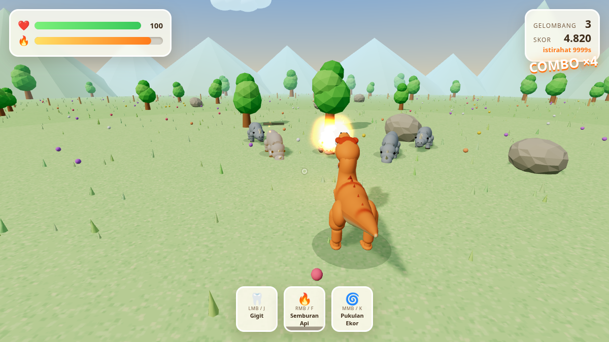

# 🦖 Rhino Rex

Game aksi 3D di browser: kamu adalah **T-Rex** yang diserbu kawanan **badak penyeruduk**.
Semburkan api, gigit, dan sabetkan ekor untuk bertahan gelombang demi gelombang.

**Main sekarang → https://havban.github.io/rhino-rex/**



## Fitur

- **Sudut pandang orang ketiga** dari belakang T-Rex. Kamera mengekor sendiri ke belakang
  setelah kamu berhenti menggeser layar — makin cepat saat berlari — tapi geseran bebas
  tetap bisa memutar sudut pandang ke mana pun, termasuk dari depan atau dari atas.
- **Empat serangan**
  - 🔥 **Semburan api** — kerucut api jarak jauh, memberi efek terbakar (damage over time).
  - 🦷 **Gigitan** — cepat, kerusakan besar di depan moncong.
  - 🌀 **Pukulan ekor** — T-Rex otomatis berputar menghadap badak terdekat, memutar badan
    satu putaran penuh sehingga ekornya menyapu 360°, lalu kembali ke arah semula.
  - ☄️ **Bola api** — lemparan melengkung yang meledak: kerusakan langsung + ledakan area
    yang melempar dan membakar. Membidik sendiri ke badak yang ada di depanmu, memakai
    40 meteran api, jeda 3 detik.
- **Badak yang menyeruduk** — mereka mengais tanah dulu (aba-aba), lalu menerjang lurus.
  Menepilah; kalau mereka menabrak pohon atau batu mereka pusing dan menerima kerusakan ekstra.
- **Empat jenis badak**: anakan yang gesit, banteng, badak berbaju zirah, dan **Matriark** raksasa
  yang muncul tiap gelombang kelima.
- **Tema cerah**: padang rumput hijau, langit biru, bunga warna-warni, awan, dan perbukitan.
- **Model halus**: T-Rex bertulang (SkinnedMesh) dengan tengkorak dalam bergigi, tangan
  kecil bercakar, dan kaki digitigrade; badak bertubuh tong dengan dua tanduk.
- Gelombang tanpa akhir, skor + combo, buah semangka penyembuh.
- **🏆 Papan skor** dengan dua tab: **Global** (semua pemain) dan **Perangkat ini**
  (`localStorage`). Papan global dilayani Cloudflare Worker + D1 di `worker/` — lihat
  [worker/README.md](worker/README.md). Selama `API` di `js/leaderboard.js` masih kosong,
  permainan otomatis memakai papan lokal saja dan tidak menghubungi apa pun; kalau API-nya
  mati atau lambat, permainan tetap jalan dan skor tetap tersimpan di perangkat.
- **Pemandangan yang bisa dihancurkan**: pohon terbakar sampai gosong lalu tumbang dan
  menyisakan tunggul hangus; batu pecah jadi puing. Semburan api membakar, bola api
  meledakkan, sapuan ekor menghantam, dan badak yang menyeruduk meleset ikut merobohkannya.
  Yang roboh tidak lagi menghalangi jalan, lalu tumbuh/terbentuk kembali sekitar setengah
  menit kemudian — jadi arenanya terus berubah bentuk tanpa pernah gundul.
- **Responsif**: satu build jalan di ponsel, tablet, dan laptop. Kontrol sentuh muncul
  otomatis di layar sentuh (dan laptop layar-sentuh tetap bisa pakai keyboard + mouse),
  HUD merapat di layar pendek, bidang pandang melebar di mode potret, resolusi render
  turun-naik sendiri kalau perangkat mulai tersengal.

## Kontrol

| Aksi | Tombol |
| --- | --- |
| Bergerak | `W A S D` (relatif kamera) |
| Kamera | Gerakkan mouse (klik kanvas untuk mengunci pointer) atau tahan-seret |
| Lari | `Shift` |
| Lompat | `Spasi` |
| Gigit | Klik kiri / `J` |
| Semburan api | Klik kanan (tahan) / `F` |
| Pukulan ekor | Klik tengah / `K` |
| Bola api | `R` atau `E` |
| Jeda | `Esc`, atau tombol **II** di tengah atas layar |

Di ponsel/tablet: joystick di kiri, geser separuh layar kanan untuk memutar kamera,
tombol bulat di kanan untuk menyerang, lompat, dan lari, tombol **II** di atas untuk jeda.
Layar masuk mode layar-penuh saat permainan dimulai, dan kembali penuh saat kamu menekan
"Lanjut" setelah jeda. Di laptop ada tombol **⛶ Layar penuh** di menu. Mode lanskap paling lega, tapi potret tetap jalan.

## Main bersama (co-op online)

Dua sampai empat pemain melawan kawanan yang sama. Menu → **👥 Main Bersama** → *Buat Room*
memberi kode empat huruf; teman memasukkan kode itu untuk bergabung.

Pembagian tugasnya sengaja sederhana — model "teman yang dipercaya":

| | Pemilik |
| --- | --- |
| Posisi dan nyawa tiap dinosaurus | pemain itu sendiri |
| Badak, gelombang, dan skor | tuan rumah |

Tamu tidak menghitung kerusakan sendiri; mereka *mengklaim* ke tuan rumah ("aku menggigit
badak #7 sebesar 26") dan tuan rumah yang memutuskan. Tamu bisa saja berbohong — tapi tamu
juga bisa mengedit permainannya sendiri, dan ini co-op dengan orang yang kamu undang lewat
kode room, jadi tidak perlu lebih dari ini.

Lalu lintas permainannya **langsung antar-peramban** lewat WebRTC: Worker hanya
memperantarai jabat tangan (polling HTTP biasa, tanpa WebSocket dan tanpa Durable Objects),
sehingga tetap muat di paket gratis dan tidak ada biaya per-paket. Tanpa server TURN,
sebagian kecil jaringan ketat memang gagal menyambung — lobinya melaporkan itu, bukan
menggantung.

Kalau kamu tumbang, kamu bangkit lagi setelah 6 detik. Permainan baru berakhir kalau semua
pemain tumbang bersamaan. Mode ini butuh `API` di `js/leaderboard.js` terisi (Worker yang
sama dengan papan skor global) — kalau kosong, tombolnya menjelaskan itu dan permainan solo
tetap jalan seperti biasa.

Yang belum: buah semangka penyembuh belum direplikasi (hanya tuan rumah yang melihatnya),
dan belum ada mode lawan-lawanan.

## Statistik & analitik

Ada dua lapis, dan keduanya terpisah.

**1. Statistik lokal (selalu aktif, tidak pernah keluar dari perangkat).**
Buka `?stats=1` — misalnya <https://havban.github.io/rhino-rex/?stats=1> — atau ketik
`__stats()` di konsol. Panel kecil di pojok kiri-bawah menampilkan jumlah permainan,
total waktu main, badak dikalahkan, matriark, skor terbaik, rata-rata gelombang, dan
proporsi pemakaian tiap senjata. Tersimpan di `localStorage` (`rr.stats`), ada tombol
reset. Pemain biasa tidak akan pernah melihat panel ini.

**2. Kiriman agregat ke GoatCounter (aktif).**
Cuplikan resmi GoatCounter ada di `index.html`:

```html
<script data-goatcounter="https://havban.goatcounter.com/count"
        async src="//gc.zgo.at/count.js"></script>
```

Skrip itu menghitung tampilan halaman sendiri; `js/analytics.js` menambahkan *custom
event* lewat `window.goatcounter.count()` — `run-start`, `wave-<rentang>`,
`score-<rentang>`, `weapon-<terfavorit>`, dan `boss-killed` setiap permainan selesai.
Skor dan gelombang dikelompokkan ke rentang supaya dasbornya berupa sebaran, bukan
ribuan angka unik.

**Pengunjung unik.** GoatCounter sudah memisahkan *Visits* dari *Pageviews* di dasbornya —
itu hitungan kunjungan uniknya, dibuat di sisi server dari hash harian IP + user agent, dan
tidak perlu diapa-apakan. Yang tidak bisa diketahui GoatCounter adalah apakah suatu peramban
pernah ke sini sebelumnya, jadi itu ditambahkan sendiri: pada muat pertama dikirim
`visitor-new`, pada hari berikutnya `visitor-returning` plus `hari-aktif-<rentang>`
(1, 2-5, 6-19, 20+). Paling banyak sepasang kejadian per perangkat per hari, jadi angkanya
terbaca sebagai "perangkat unik hari ini". Tidak ada pengenal yang disimpan — hanya tanggal
pertama, tanggal terakhir, dan jumlah hari aktif di `localStorage`, yang juga tampil di
panel `?stats=1`. Endpoint hanya ditulis di satu tempat (atribut `data-goatcounter`);
modulnya membacanya dari situ, dan kalau `count.js` diblokir pemblokir iklan, modul
beralih ke endpoint piksel setelah 6 detik.

Dasbor: <https://havban.goatcounter.com> — buka **Settings → private** supaya hanya kamu
yang bisa membacanya. GoatCounter tidak memakai cookie, tidak menyimpan data pribadi,
menghormati *Do Not Track*, dan tidak menghitung kunjungan dari `localhost` (jadi
pengembangan lokal tidak mengotori angkanya).

Mau mematikan? Hapus tag `<script>` itu dari `index.html` — panel statistik lokal tetap
jalan. Mau pakai layanan lain (misalnya Cloudflare Web Analytics yang gratis tanpa batas
tapi tanpa custom event, atau Umami Cloud)? Hapus tagnya dan pasang
`window.__rrTrack = (path, title, isEvent) => { ... }` sebelum game dimuat.

## Teknis

- [Three.js](https://threejs.org) r160, di-*vendor* ke `vendor/three.module.js` (tanpa CDN, tanpa build step).
- Semua model dibuat prosedural — tidak ada aset 3D eksternal. Tubuh T-Rex dan badak adalah
  permukaan halus yang disapu sepanjang tulang punggung (penampang elips dengan profil jari-jari
  Catmull-Rom), bukan tumpukan kotak. T-Rex memakai `SkinnedMesh` dengan rangka tulang, sehingga
  leher dan ekor melengkung mulus saat berlari dan menyabet.
- Kepala, kaki, dan tanduk dibentuk dari elipsoid dan kapsul ber-*smooth shading* dengan bahan
  Phong, jadi siluetnya membulat, bukan bersudut.
- Efek api/debu memakai satu sistem partikel `THREE.Points` dengan shader kustom.
- Suara **dan musik** disintesis lewat Web Audio API — tidak ada satu pun file audio.
  Musiknya punya penjadwal 16-nada-per-birama dengan empat lapisan yang menyala mengikuti
  keadaan permainan: tenang saat istirahat, perkusi masuk saat bertarung, melodi menyusul,
  dan lapisan bawah tambahan saat Matriark muncul. Empat gaya bisa dipilih di menu
  (**Musik**): Padang Ceria, Jurassic Stomp, Chiptune Rampage, Synthwave Predator, atau mati.
- Situs statis murni: cukup buka `index.html` lewat web server apa pun.

### Menjalankan secara lokal

```bash
git clone git@github.com:havban/rhino-rex.git
cd rhino-rex
python3 -m http.server 8777
# lalu buka http://localhost:8777
```

### Struktur

```
index.html          # HUD, menu, importmap
css/style.css       # tema cerah
js/config.js        # semua angka penyetelan (damage, kecepatan, gelombang)
js/main.js          # loop utama, gelombang, resolusi serangan
js/rex.js           # model + animasi + gerak T-Rex
js/rhino.js         # model + AI badak (kejar → aba-aba → seruduk → pusing)
js/world.js         # arena, langit, pohon, batu, rumput
js/geom.js          # pembangun permukaan halus (sapuan tabung, elipsoid, kapsul)
js/fireball.js      # proyektil bola api (lintasan melengkung + ledakan)
js/scores.js        # papan skor lokal (localStorage)
js/leaderboard.js   # klien papan skor global (gagal-lunak)
js/net.js           # sambungan WebRTC + kanal data (jabat tangan lewat Worker)
js/multiplayer.js   # sesi co-op: replikasi pemain, badak, dan klaim kerusakan
worker/             # Cloudflare Worker + skema D1 untuk papan global
js/analytics.js     # statistik lokal + kiriman agregat opsional (mati bawaan)
js/fx.js            # partikel, angka kerusakan, guncangan kamera
js/camera.js        # kamera orang ketiga
js/input.js         # keyboard/mouse/sentuh
js/audio.js         # sound effect prosedural
js/music.js         # musik latar prosedural (4 gaya, lapisan adaptif)
```

Objek `window.__game` diekspos untuk debugging (`state`, `rex`, `rhinos`, `cfg`, ...).

## Pembaruan

Situsnya memberi tahu sendiri kalau ada versi baru: alur penerbitan menyisipkan id commit
ke halaman dan ke `version.json`, lalu halaman yang sedang terbuka membandingkannya tiap
lima menit (dan setiap tab kembali aktif). Kalau berbeda, muncul notifikasi kecil
**✨ Versi baru tersedia — Muat ulang**. Tombol **🔄 Muat ulang halaman** juga ada di layar
jeda. Keduanya memuat ulang lewat `?v=<build>` supaya tidak kena cache GitHub Pages yang
sepuluh menit.

## Dokumentasi

Dokumentasi teknis lengkap ada di [`docs/`](docs/) (bahasa Inggris, untuk yang mengerjakan
kodenya): [arsitektur](docs/architecture.md), [gameplay](docs/gameplay.md),
[multiplayer](docs/multiplayer.md), [backend](docs/backend.md),
[analitik](docs/analytics.md), [pengujian](docs/testing.md), dan
[pemecahan masalah](docs/troubleshooting.md).

Mau ikut mengubah kodenya? Baca [`AGENTS.md`](AGENTS.md) dulu — isinya aturan main repo ini
dan daftar jebakan yang sudah pernah memakan waktu.

## Lisensi

MIT
